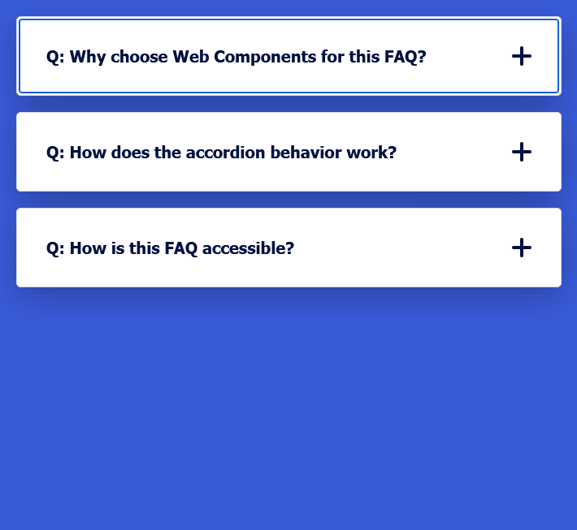

# FAQ Section using Web Components

A lightweight, clean, and accessible FAQ section implemented with Web Components and accordion functionality.

</img>

## Run locally

```bash
python -m http.server 8080
```
